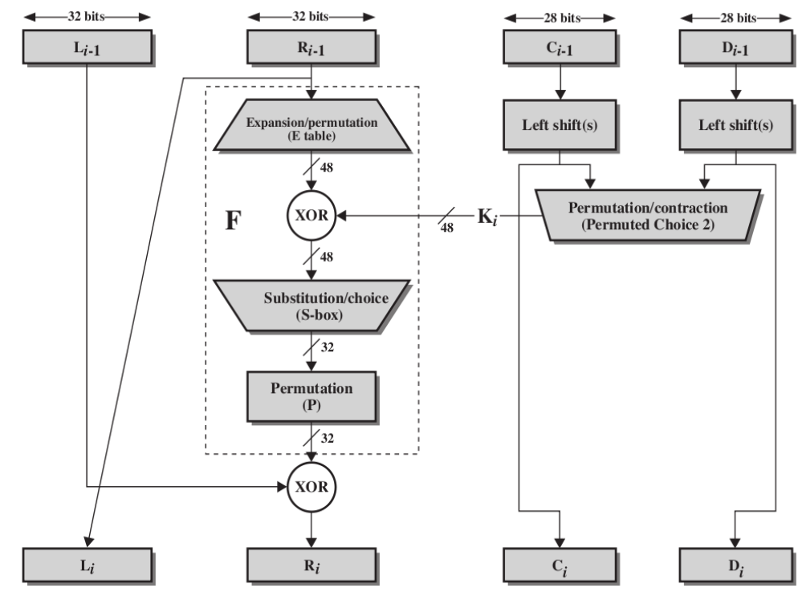

# DES Encryption algorithm

## Algorithm Procedure
The **DES Encryption Algorithm** a symmetric-key block cipher created in the early 1970s by an IBM team and adopted by the **National Institute of Standards and Technology(NIST)**.

The general **DES Encryption Algorithm** is followed by the chart:


The single round of **DES Algorithm** is followed by the chart:


The calculation of *F(R,K)* is followed by the chart:


## Terminal Compiling
The whole code files are *main.cpp*, *DES.cpp*, *DES.h*,*Tables.h*, you can also use command *g++* to compile these files. The command example is below: 
```text
g++ -std=c++14 -o DES DES.cpp main.cpp
```
## Output example
```
Please input 64 bits plaintext and key in hexadecimal.
plaintext:0123456789ABCDEF
key:133457799BBCDFF1
 Round                Text                 Key
     1    F0AAF0AAEF4A6544      E19955FAACCF1E
     2    EF4A6544CC017709      C332ABF5599E3D
     3    CC017709A25C0BF4      0CCAAFF56678F5
     4    A25C0BF477220045      332ABFC599E3D5
     5    772200458A4FA637      CCAAFF06678F55
     6    8A4FA637E967CD69      32ABFC399E3D55
     7    E967CD69064ABA10      CAAFF0C678F556
     8    064ABA10D5694B90      2ABFC339E3D559
     9    D5694B90247CC67A      557F8663C7AAB3
    10    247CC67AB7D5D7B2      55FE199F1EAACC
    11    B7D5D7B2C5783C78      57F8665C7AAB33
    12    C5783C7875BD1858      5FE19951EAACCF
    13    75BD185818C3155A      7F866557AAB33C
    14    18C3155AC28C960D      FE19955EAACCF1
    15    C28C960D43423234      F866557AAB33C7
    16    434232340A4CD995      F0CCAAF556678F
plaintext:    0123456789ABCDEF
  key:    133457799BBCDFF1
ciphertext:    85E813540F0AB405
```