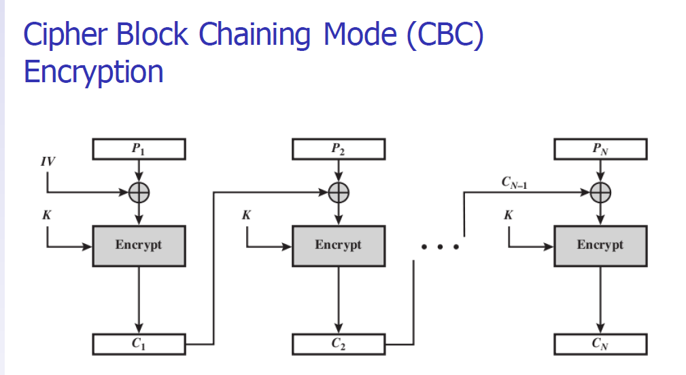
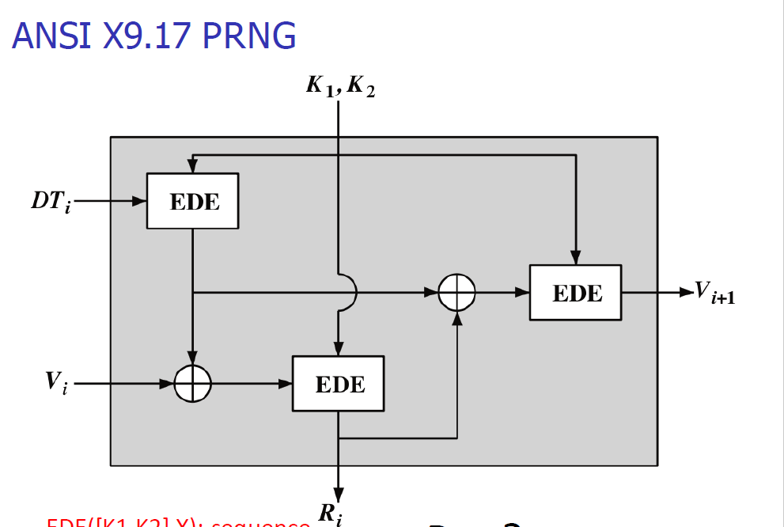

# Contents
- [Contents](#contents)
- [Classical Encryption Techniques](#classical-encryption-techniques)
  - [Model of Encryption for Confidentiality](#model-of-encryption-for-confidentiality)
  - [Terminology](#terminology)
  - [Caesar Cipher](#caesar-cipher)
  - [PlayFair Cipher](#playfair-cipher)
  - [Vigenere Cipher](#vigenere-cipher)
  - [Transposition](#transposition)
    - [Rail FenceTransposition](#rail-fencetransposition)
    - [Rows/ColumnsTransposition](#rowscolumnstransposition)
- [Simple-DES](#simple-des)
  - [Algorithm](#algorithm)
  - [Operations](#operations)
  - [S-Boxes](#s-boxes)
  - [Comparing S-DES and DES](#comparing-s-des-and-des)
  - [Summary](#summary)
- [Block Ciphers](#block-ciphers)
  - [Block Ciphers Principles](#block-ciphers-principles)
    - [Block Ciphers and Stream Ciphers](#block-ciphers-and-stream-ciphers)
    - [Reversible and Irreversible Mappings](#reversible-and-irreversible-mappings)
  - [Block Cipher Operation](#block-cipher-operation)
    - [ECB](#ecb)
    - [CBC](#cbc)
    - [CFB](#cfb)
    - [OFB](#ofb)
    - [CTR](#ctr)
    - [Feedback Characteristics of Modes](#feedback-characteristics-of-modes)
    - [XTS-AES](#xts-aes)
- [Pseudo-Random Numbers and Stream Ciphers](#pseudo-random-numbers-and-stream-ciphers)
  - [Random Numbers](#random-numbers)
  - [TRNG, PRNG and PRF](#trng-prng-and-prf)
  - [Linear Congruential Generator](#linear-congruential-generator)
  - [Blum Blum Shub (BBS) Generator](#blum-blum-shub-bbs-generator)
  - [PRNG Mechanisms Based on BlockCiphers](#prng-mechanisms-based-on-blockciphers)
    - [ANSI X9.17 PRNG](#ansi-x917-prng)
  - [RC4](#rc4)
- [Fundamentals of Number Theory](#fundamentals-of-number-theory)
  - [Divisibility and Prime Numbers](#divisibility-and-prime-numbers)
    - [Divisibility](#divisibility)
    - [Prime Numbers](#prime-numbers)
  - [ModularArithmetic](#modulararithmetic)
    - [Properties of ModularArithmetic](#properties-of-modulararithmetic)
    - [Division in Modular Arithmetic](#division-in-modular-arithmetic)
    - [Fermat's Theorem](#fermats-theorem)
    - [Euler's Totient Function](#eulers-totient-function)
    - [Euler's Theorem](#eulers-theorem)
    - [Logarithms in Modular Arithmetic](#logarithms-in-modular-arithmetic)
    - [Prime Roots](#prime-roots)

# Classical Encryption Techniques
## Model of Encryption for Confidentiality


## Terminology

|  |  |
|-------------|------------------------------|
|Plaintext      |Plaintextoriginal message         |
|Ciphertext |encrypted or coded message|
|Encryption |convert from plaintext to ciphertext (enciphering)|
|Decryption|restore the plaintext from ciphertext (deciphering)|
|Key|information used in cipher known only to sender/receiver|
|Cipher|a particular algorithm (cryptographic system) |
|Cryptography| study of algorithms used for encryption|
|Cryptanalysis|study of techniques for decryption without knowledge of plaintext|
|Cryptology|areas of cryptography and cryptanalysis|

## Caesar Cipher

> Alphabet Mod 
>    |letter |mod |
>    |--------|--------- |
>    |a/A     |0         |
>    |b/B     |1         |
>    |c/C     |2         |
>    |d/D     |3         |
>    |e/E     |4         |
>    |f/F     |5         |
>    |g/G     |6         |
>    |h/H     |7         |
>    |i/I     |8         |
>    |j/J     |9         |
>    |k/K     |10        |
>    |l/L     |11        |
>    |m/M     |12        |
>    |n/N     |13        |
>    |o/O     |14        |
>    |p/P     |15        |
>    |q/Q     |16        |
>    |r/R     |17        |
>    |s/S     |18        |
>    |t/T     |19        |
>    |u/U     |20        |
>    |v/V     |21        |
>    |w/W     |22        |
>    |x/X     |23        |
>    |y/Y     |24        |
>    |z/Z     |25        |

Generalized Caesar Cipher formal :
$$
\begin{aligned}
    c=E(k,p)=(p+k)\rm {mod} 26 \\
    p=D(k,c)=(c−k)\rm {mod} 26
\end{aligned}
$$

## PlayFair Cipher

Initialization :
1. Create 5x5 matrix and write keyword (row by row)
2. Fill out remainder with alphabet, not repeating any letters
3. Special: Treat I and J as same letter

Encryption: 
1. Operate on pair of letters (diagram) at a time
2.  if diagram with same letters, separate by special letter (e.g.x)
    
    if the total number is odd, add special letter (e.g.x) into the end

3.  Plaintext in same row: replace with letters to right
    Plaintext in same column: replace with letters below
    Else, replace by letter in same row as it and same column as other plaintext letter
   
Example :

- Plaintext:hello
- Keyword:thailand

To get key matrix : 
$$
\begin{matrix}
    t & h & a & i & l \\
    n & d & b & c & e \\
    f & g & k & m & o \\
    p & q & r & s & u \\
    v & w & x & y & z 
\end{matrix}
$$
and the pair of plaintext : *he lx lo* matching *ld az eu*.

Finally, Ciphertext is **ldazeu**
## Vigenere Cipher
- Set of 26 general Caesar ciphers
- Letter in key determines the Caesar cipher to use
    > Key must be as long as plaintext: repeat a keyword

Example:

- Plain: internettechnologies
- Key:sirindhorn(sirindhorn)
- Cipher:AVKMEQLHKRUPEWYRNWVF
  
## Transposition

### Rail FenceTransposition

- Plaintext letters written in diagonals over N rows (depth)
- Ciphertext obtained by readingrow-by-row

Example : 

- plaintext: technologies
- depth:3

$$
\begin{matrix}
    t&  &  &  &n &  &  &  &g &  &  &  \\
     &e &  &h &  &o &  &o &  &i &  &s \\
     &  &c &  &  &  &l &  &  &  &e &
\end{matrix}
$$
Finally, the ciphertext : **tngehooiscle**
### Rows/ColumnsTransposition
- Plaintext letters written inrows
- Ciphertext obtained by reading column-by-column, but re-arranged
- Key determines order of columns to read

Example: 

- plaintext: securityandcryptography
- key:315624
matrix :
$$
\begin{matrix}
    3 & 1 & 5 & 6 & 2 & 4\\
    s & e & c & u & r & i \\
    t & y & a & n & d & c\\
    r & y & p & t & o & g \\
    r & a & p & h & y 
\end{matrix}
$$
Finally, the ciphertext : **eyyardoystrricgcappunth**.

# Simple-DES
## Algorithm
- Input (plaintext) block : 8-bits

- Output (ciphertext) block : 8-bits

- Key : 10-bits

- Rounds : 2

> Round keys generated using **permutationsand** and **left shifts**

The flowchart of **Algorithm** :


The flowchart of **Key Generation** :


The flowchart **Encryption Details** :


## Operations
- P10
  
||||||||||||
|---------|---|---|---|---|---|---|---|---|---|---|
|Input     |1 |2 |3 |4 |5 |6 |7 |8 |9 |10 |
|Output    |3 |5 |2 |7 |4 |10 |1 |9 |8 |6 |

- P8 
 
||||||||||||
|---------|---|---|---|---|---|---|---|---|---|---|
|Input     |1 |2 |3 |4 |5 |6 |7 |8 |9 |10 |
|Output    |6 |3 |7 |4 |8 |5 |10 |9 | | |

- P4

||||||
|---------|---|---|---|---|
|Input     |1 |2 |3 |4 |
|Output    |2 |4 |3 |1 | 

- EP(expand and permutation)

||||||||||
|---------|---|---|---|---|---|---|---|---|
|Input     |1 |2 |3 |4 |  |  |  |  |
|Output    |4 |1 |2 |3 |2 |3 |4 |1 | 

- IP(initial permutation)

||||||||||
|---------|---|---|---|---|---|---|---|---|
|Input     |1 |2 |3 |4 |5 |6 |7 |8 |
|Output    |2 |6 |3 |1 |4 |8 |5 |7 |
- $\rm{IP^{-1}}$(inverse of IP)
- LS-1(left shift 1 position with **Loop**)
- LS-2(left shift 2 positions with **Loop**)

## S-Boxes
S-DES (and DES) perform substitutions using **S-Boxes**, which considered as a matrix and used to select row/column.
- 4-bit input: $\rm{bit_1, bit_2, bit_3,bit_4}$
    - $\rm{bit_1 bit_4}$ specify row(0, 1, 2 or 3 in decimal)
    - $\rm{bit_2 bit_3}$ specify column
- 2-bit output

$S_0$ :
| |0  |1  |2  |3|
|---|---|---|---|---|
|0     |01  |00  |11  |10|
|1     |11  |10  |01  |00|
|2     |00  |10  |01  |11|
|3     |11  |01  |11  |10|

$S_1$ :
| |0  |1  |2  |3|
|---|---|---|---|---|
|0     |00  |01  |10  |11|
|1     |10  |00  |01  |11|
|2     |11  |00  |01  |00|
|3     |10  |01  |00  |11|

> Example 
>
> - Plaintext:01110010 
> - Key:1010000010
> - <font color=red >**Ciphertext:01110111**</font>
>  
> Process:

## Comparing S-DES and DES
Specifically algorithm and flow chart of S-DES can referred to [Section Simple-DES](#simple-des) above, in this part we only summary the realization of 64 bits DES.
> [Project of DES](https://github.com/Tim-eyes/Encryption/tree/master/Project)

|S-DES|DES|
|--------------------------------|----------------------------------|    
| 8-bit blocks|64-bit blocks|
| 10-bit key: 2 x 8-bit round keys|56-bit key: 16 x 48-bit round keys| 
| IP:8-bits| IP: 64bits|
| F operates on 4bits|F operates on 32bits| 
| 2 S-Boxes|8 S-Boxes|
| 2 rounds |16 rounds|
## Summary
> **S-DES functional expression**

- ${\rm ciphertext}={\rm IP}^{-1}(f_{k2}({\rm SW}(f_{k1}({\rm IP}(\rm {plaintext})))))$

- ${\rm plaintext}={\rm IP}^{-1}(f_{k1}({\rm SW}(f_{K2}({\rm IP}(\rm {ciphertext})))))$

> **Security of S-DES**
# Block Ciphers 

## Block Ciphers Principles
### Block Ciphers and Stream Ciphers
|Block Ciphers|Stream Ciphers|
|--------------------------------|----------------------------------|    
| Encrypt a block of plaintext as a whole to produce same sized ciphertext|Encrypts a digital data stream one bit or one byte at a time|
|Typical block sizes are 64or 128 bits|One time pad is example; but practical limitations| 
|||

> Encrypt one byte at a time by XOR with pseudo-random byte
> 
> 
### Reversible and Irreversible Mappings
- n-bit block cipher takes n bit plaintext and produces n bit ciphertext.
- 2n possible different plaintext blocks.
- Encryption must be reversible(decryption possible).
- Each plaintext block must produce unique ciphertext block. 
 
## Block Cipher Operation
### ECB
Electronic Code Book
- Each block of 64 plaintext bits is encoded independently using same key.
- Typical applications: secure transmission of single values (e.g. encryption key).
- Problem: with long message, repetition in plaintext may cause repetition in ciphertext.


$$
C_i=E(P_i,K) \\
P_i=D(E_i,K) \\\quad i\in[1,N] 
$$
### CBC
Cipher Block Chaining Mode
- Input to encryption algorithm is XOR of next 64-bits plaintext and preceding 64-bits ciphertext
- Typical applications: General-purpose <font color=red> block-oriented </font>transmission;authentication
- Initialisation Vector (IV) must be known by sender/receiver, but secret from attacker
    - In particular, it must be impossible to predict the IV for any given plaintext;
    - For maximum security, IV should be protected against unauthorized changes.
    E.g., send the IV using ECB encryption.


$$
C_1=E((P_1 \oplus \text{IV}),K)\\
C_i=E((P_i \oplus C_{i-1}),K) \quad  i\in[2,N] 
$$

$$
P_i=D(C_i,K) \oplus C_i-1 \quad i\in[2,N] \\
P_1=D(C_1,K) \oplus \text{IV}
$$


### CFB
Cipher Feedback Mode
- Converts block cipher into **stream cipher**
  - No need to pad message to integral number of blocks
  - Operate in real-time: each character encrypted and transmitted immediately
- Input processed s bits at a time
- Preceding ciphertext used as input to cipher to produce pseudo-random output
- XOR output with plaintext to produce ciphertext
- Typical applications: General-purpose <font color=red>stream-oriented</font> transmission, authentication


$$
I_1=\text{IV} \\
I_i=MSB_s(O_{i-1}) Joint C_i \\
O_i=E(I_i,K)\\
C_i=P_i \oplus MSB_s(O_i)\\
P_i=Ci \oplus  MSB_s(O_i)\\
$$

$$
$$
### OFB
Output Feedback Mode
- Converts block cipher into **stream cipher**
  - OFB has structure of a typical stream cipher
  - Distinction from the stream cipher is OFB encrypts a full block at a time; while many stream ciphers encrypt one byte at a time.
- Similar to CFB, except input to encryption algorithm is preceding encryption output
- Typical applications: <font color=red>stream-oriented</font> transmission over noisy channels (e.g. satellite communications)
- Advantage compared to CFB: bit errors do not propagate
- Disadvantage: more vulnerable to message stream modification attack


$$
O_1=E(\text{Nonce},K)\\
C_1=O_1 \oplus P_1\\
O_i=E(O_{i-1},K)\quad i->2...N\\
C_i =E(O_{i-1},K) \oplus P_i \quad i->1...N\\
$$

$$
O_1=E(\text{Nonce},K)\\
P_1=O_1 \oplus C_1\\
O_i=E(O_{i-1},K)\quad i->2...N\\
P_i =E(O_{i-1},K) \oplus C_i \quad i->1...N\\
$$
### CTR
Counter Mode
- Converts block cipher into **stream cipher**
- Each block of plaintext XOR with encrypted counter
- Typical applications: General-purpose <font color=red>block-oriented</font> transmission; useful for high speed requirements
- Efficient hardware and software implementations
- Simple and secure


$$
C_i=E(\text{Cnt}_i,K_i) \oplus P_i \quad i\in[1,N]
$$

$$
P_i=E(\text{Cnt}_i,K_i) \oplus C_i \quad i\in[1,N]
$$
> **CFB OFB CTR Convert block cipher into stream cipher**

### Feedback Characteristics of Modes


### XTS-AES
In this section we mainly discuss **XTS-AES** Encryption and decryption of single block

$$
PP=P_j \oplus T \\
T=E(i,K_2) \oplus a^j\\
CC=E(PP,K_1)\\
C_j=T \oplus CC\\
$$

$$
CC=C_j \oplus T\\
PP=D(CC,K)\\
P_j=PP \oplus T\\
$$
> Proof Decrypted P = Plaintext P
> $$ \begin{aligned}
     P_j&=D(CC,K_1) \oplus T\\
       &=D(E(PP,K_1),K1) \oplus T\quad (CC=E(PP,K_1))\\
       &=PP \oplus T\\
       &=T \oplus P_j \oplus T\\
       &=P_j \\
\end{aligned}
    $$

# Pseudo-Random Numbers and Stream Ciphers
## Random Numbers
Randomness
- Uniform distribution: frequency of occurrence of 1’s and 0’s approximately equal
- Independence: no sub-sequence can be inferred from others
> 0000000000 all no 
> 0000011111 yes 
> 0101010101   independence  
## TRNG, PRNG and PRF
1. True Random Number Generator
- Non-deterministic source, physical environment
- Detect ionizing radiation events, leaky capacitors, thermal noise from resistors or audio inputs
- Mouse/keyboard activity, I/O operations,interrupts
- Inconvenient, small number of values
2. Pseudo Random NumberGenerator
- Deterministic algorithms to calculate numbers in “relatively random”sequence
- Input seed
- Produces **continuous** stream of random bits
3. Pseudo Random Function
- Same as **PRNG** but produces string of bits of some fixed length


## Linear Congruential Generator
$$
X_{n+1}=(aX_n+c)\mod m
$$
- $m$, the modulus, $m >0$
- $a$, the multiplier, $0 < a <m$
- $c$ , the increment, $0 \le c <m$
- $X_0$, the seed, $0 \le X_0 <m$

> Example
> 
> Case 1:
> $a = 1, c = 1, m = 100$
> Seed: $X_0= 23$
> - Generate the pseudo-random number sequence.
> - Find the sequence period (how many different numbers in the generated stream).
>
> $X_n ={23,24,25,26....22},\text{period} = 100$
>
> Case 2:
> $a = 5, c = 0, m = 32$
> Seed: $X_0= 3$
>
> $X_n={3,15,11,23,19,31,27,7},\text{period} = 8$
## Blum Blum Shub (BBS) Generator
Parameters:
- p, q: largeprimenumbers such that $p \equiv q \equiv 3 \pmod4$
- $n = p \times q$
- $s$ , random number relatively prime

Generate sequence of bits, $B_i$:
$$
X_0=s^2 \mod n\\
X_i={X_{i-1}}^2 \mod n\\
B_i=X_i\mod 2\\
   i\in(1,\infty)
$$
## PRNG Mechanisms Based on BlockCiphers
Use symmetric block ciphers (e.g. AES, DES) to produce pseudo-random bits
### ANSI X9.17 PRNG
Cryptographically secure (one of the strongest) PRNG using Triple DES Parameters:
- Input 1:64-bit representation of the date& time,Dti
  - Updated on each number generation.
- Input 2:64-bit seed value,Vi
  - Initialized to arbitrary value, being updated.
- Keys:Pair of 56-bitDES keys, K1 andK2

Operation:
- Uses Triple DES three times

Output:
- 64-bitpseudo-random number,Ri
- 64-bitseed value, Vi+1
  

$$
R_i=\text{EDE}([K_1,K_2],\text{EDE}([K_1,K_2],DT_i) \oplus V_i)\\
V_{i+1}=\text{EDE}([K_1,K_2],\text{EDE}([K_1,K_2],DT_i) \oplus R_i)
$$
> $\text{EDE}([K_1,K_2],X)$: sequence encrypt-decrypt-encrypt using two-key triple DES for encryption.

## [RC4](https://github.com/Tim-eyes/Encryption/tree/master/RC4_Algorithms)
For this section I try to realize a simple project of 256-bit RC4 Encryption, including a simply script written in **Python**, which supported by [@KennardWang](https://github.com/KennardWang).    

# Fundamentals of Number Theory 
## Divisibility and Prime Numbers
### Divisibility
$\text{gcd}(a, b)$: **greatest common**divisor of $a$ and $b$
> Two integers, a and b, are <font color=red>relatively prime</font> if $\text{gcd}(a,b)=1$
> If $A = B⋅Q + R$ and $B\not ={}0$ then $\text{gcd}(A,B) = \text{gcd}(B,R)$
    > where $Q$ is an integer, $R$ is an integer between $0$ and $B-1$

A program of gcd by bit operation :
```cpp
int gcd(int a,int b){
    if(a==0) return b;
    if(b==0) return a;
    if (!(a&1) && !(b&1)) return gcd((a>>1),(b>>1))<<1;
    else if(!(a&1)) return gcd((a>>1),b);
    else if(!(b&1)) return gcd(a,(b>>1));
    
    else return gcd(abs(a-b),min(a,b));
}
```
### Prime Numbers
An integer $p > 1$ is a prime number if and only if its only divisors are $1$ and $p$
$$
a=p_{1}^{a_1}+p_{2}^{a_2}+...+p_{n}^{a_n} \quad a>1
$$
> where $p_1 < p_2 < . . . < p_n$ are prime numbers and where each ai is a positive integer.
> E.g., $a=45=3^2\times5$
## ModularArithmetic
### Properties of ModularArithmetic
$$
[(a \mod n)+(b \mod n)]\mod n=(a+b)\mod n\\
[(a\mod n)−(b\mod n)]\mod n=(a−b)\mod n\\
[(a\mod n)×(b\mod n)]\mod n=(a\times b)\mod n
$$
### Division in Modular Arithmetic
$a$ is additive inverse of $b$ if $a + b \equiv 0 \pmod n$
> All integers have an additive inverse
$a$ is multiplicative inverse of $b$ if $a \times b \equiv 1 \pmod n$
- Not all integers have a multiplicative inverse
- $a$ has a multiplicative inverse in $\pmod n$ if $a$ is relatively prime to $n$
- Division: $a\div b \equiv a \times \text{MultInverse}(b)\pmod n$
> E.g., $2^{-4}\mod 9=\text{MI}(16) \mod 9=4$
### Fermat's Theorem
1. **Fermat's Theorem (1)**: if $p$ is prime and $a$ is a positive integer not divisible by $p$,then
$$
a^{p-1} \equiv 1 \pmod p
$$
2. **Fermat's Theorem (2)**: if $p$ is prime and $a$ is a positive integer ,then
$$
a^p \equiv a \pmod p
$$
> E.g.
> $$
    3^5 \mod 5=3,\quad
    3^4 \mod 5=1
> $$
### Euler's Totient Function
Euler's Totient Function, $\varphi(n)$: the number of positive integers less than $n$ and relatively prime to $n$
- $\varphi(1) =1$
- For prime $p$, $\varphi(p) = p −1$
- For $a$ relatively prime to $b$, and $n =ab$, $\varphi(n)=\varphi(a)\times \varphi(b)$
- For different primes $p$ and $q$, and $n =pq$, $\varphi(n)=(p−1)\times (q−1)$
> E.g.
> $$
    \varphi(4)=2\quad, \varphi(9)=7 \\ 
    \varphi(143)=\varphi(13-1)\times \varphi(11-1) =12\times 10=120\\
    \varphi(30)=\varphi(5)\times \varphi(6)=4\times 2=8 
> $$

### Euler's Theorem
1. **Euler's Theorem (1)**:For every $a$ and $n$ that are relatively prime:
$$
a^{\varphi(n)} \equiv 1 \pmod n
$$
2. **Euler's Theorem(2)**: For positive integers $a$ and $n$:
$$
a^{\varphi(n)+1} \equiv a \pmod n
$$
> E.g.
> $$
    \varphi(143)=\varphi(13)\times \varphi(11)=120 \quad 97^{121} \mod 143=97\\
    \varphi(161)=\varphi(7)\times \varphi(23)=132 \quad 149^{133} \mod 161=149
> $$

### Logarithms in Modular Arithmetic
Logarithms in modular arithmetic (**discrete logarithm**):
$$
    b=a^i \pmod p\\
    i=\text{dlog}_{a,p}(b)   
$$
A unique exponent $i$ can be found if $a$ is a **primitive root** of prime $p$
- If $a$ is a **primitive root** of $p$ then $a$, $a_2$, $a_3$,...,$a_{p−1}$ are distinct$\pmod p$
- Only integers with primitive roots: $2$, $4$, $p^\alpha$, $2p^\alpha$ where $p$ is any odd prime and $\alpha$ is positive integer
> E.g.
> $$
\text{dlog}_{3,7}(5) = x\\
\quad 3^x\mod 7 = 5 \Rightarrow x=5\\
\text{dlog}_{2,7}(4) = x\\
\quad 2^x\mod 7 = 4 \Rightarrow x=2\\
> $$  
### Prime Roots 
Find the primitive roots of n=7 as example.

All sequences in Table:
|$a$|$a^2$|$a^3$|$a^4$|$a^5$|$a^6$|
|---|---|---|---|---|---|
|1|1|1|1|1|1|
|2|4|1|2|4|1|
|3|2|6|4|5|1|
|4|2|1|4|2|1|
|5|4|6|2|3|1|
|6|1|6|1|6|1|

When sequences are of length $6(\varphi(7))$, it this case, $a=3,5$ ;it means the base integer a generates (via powers) the set of nonzero integers modulo 7.
-Each such integer, 3,5, is called a **primitive root** of the modulus 7.

//TBD

